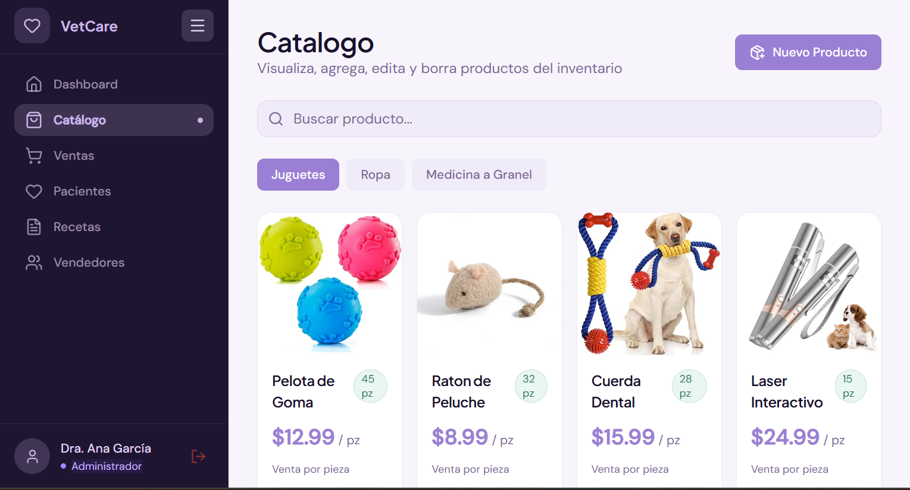

# VetCare Admin

  

VetCare Admin is a web dashboard for a veterinary clinic. It allows you to manage sales, inventory, patients, prescriptions, and users with different roles.

## ✨ Features

- General dashboard with key metrics
- Product catalog with search and management
- Sales tracking and transaction monitoring
- Patient and prescription management
- Roles and permissions for admin, salesperson, and veterinarian
- Modern responsive navigation

## 📸 Screenshots




## 🛠️ Technologies

- React 19
- TypeScript
- Vite
- React Router
- Tailwind CSS
- Recharts
- Sonner
- Lucide Icons

## 📦 Installation

```bash
npm install
```

## ▶️ Run in development

```bash
npm run dev
```

The application is usually available at:

```text
http://localhost:5173
```

## 🧪 Available scripts

```bash
npm run build
npm run lint
npm run preview
```

## 🔐 Demo credentials

The project uses simulated data for demonstration:

- Admin: `admin@vetcare.com` / `admin123`
- Salesperson: `vendedor@vetcare.com` / `vendedor123`
- Veterinarian: `veterinario@vetcare.com` / `vet123`

## 📁 Project structure

- `src/app` — main pages, routes, and layout
- `src/core` — authentication and business logic
- `src/mocks` — simulated data
- `src/types` — type definitions

## 📝 Note

This project is designed as a functional demo with local data and simulated authentication to showcase the administrative workflow.

